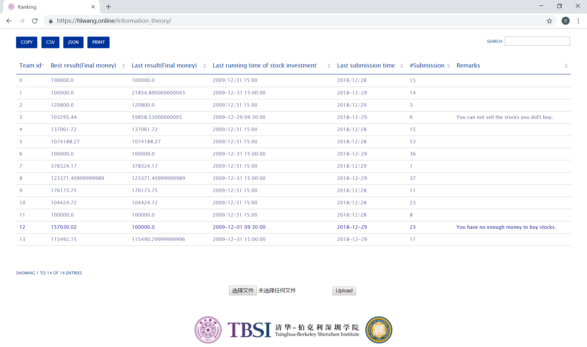
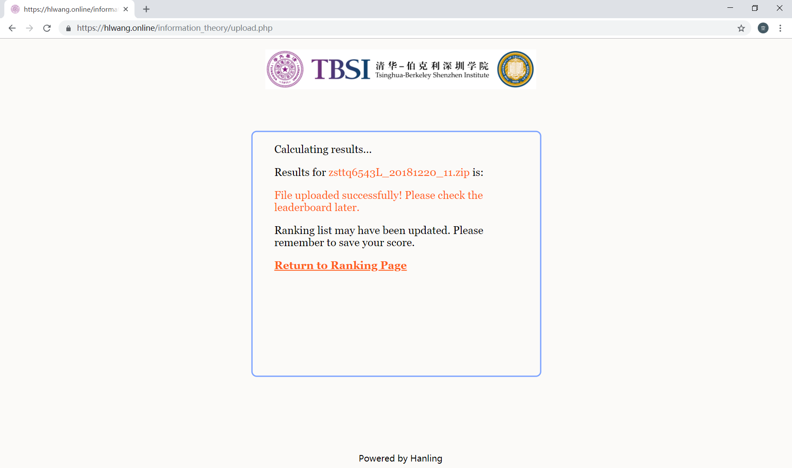
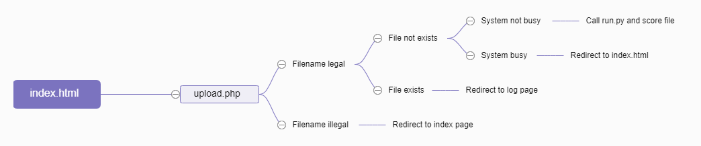

# A simple OJ (Online Judge) system

A simple OJ (Online Judge) system based on html+PHP+Python, that allows users to upload file, score results and display the ranking.

# index page
 

# upload page
 

# Flowchart:
 

# Description:
Users upload files through *index.html*, then files scored by a Python script *main.py*. After the uploaded file successfully scored, the result csv file will be updated. Last, script *run.py* will convert the updated csv file into html page by using [csvtotable](https://pypi.org/project/csvtotable/) and update *index.html*.
